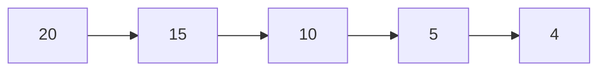
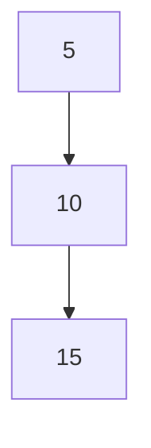
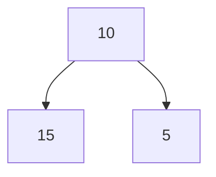

# Árbol Binario Balanceado Estándar

Si no estás familiarizado con los árboles o las Estructuras de Datos, te recomiendo leer sobre [Árboles Binarios](https://github.com/jangelmm/doc-edd-arbolbinario.git)

## Inserción y Balanceo en Árboles Binarios

Cuando insertamos datos en un árbol binario, corremos el riesgo de crear una estructura desequilibrada. Esto sucede cuando todos los nodos se acomodan a un solo lado, como se muestra a continuación:



> En este caso, todos los nodos se encuentran en el lado izquierdo del árbol, creando un árbol completamente desbalanceado.

### Árboles Balanceados

El objetivo es tener un árbol balanceado, donde cada nodo tiene dos hijos o está razonablemente equilibrado en términos de profundidad de los subárboles izquierdo y derecho.

Un ejemplo de árbol desbalanceado:


> Este árbol está desbalanceado porque todos los nodos están a la derecha.

Un ejemplo de árbol balanceado:


> Este árbol está balanceado porque los nodos están distribuidos equitativamente en ambos lados.

### Nodo Árbol Balanceado (Nodo AVL)

Para asegurar que el árbol se mantenga balanceado, usamos un tipo de nodo especial conocido como **Nodo AVL**. Este nodo mantiene información adicional, llamada **factor de equilibrio**, que ayuda a determinar si el árbol necesita reequilibrarse después de cada inserción o eliminación.

## Implementación del Árbol Binario Balanceado

### Constructor

El constructor inicializa el árbol con una raíz nula.

```Java
public class ArbolBinarioBalanceado {
    private NodoArbol raiz; // Donde empieza el árbol

    // Métodos
    public ArbolBinarioBalanceado() {
        this.raiz = null;
    }
}
```

### Método para Insertar Balanceado con Recursividad

El método `insertarBalanceado` permite agregar elementos al árbol de manera que se mantenga balanceado. Utiliza recursividad para encontrar la posición correcta del nuevo nodo y ajustar los factores de equilibrio según sea necesario.

```Java
public class ArbolBinarioBalanceado {
    private NodoArbol raiz; // Donde empieza el árbol

    // Métodos
    public boolean insertarBalanceado(Object o) {
        // Implementación de insertar balanceado
    }

    private boolean agregarRecursiva(Object o, NodoArbol n) {
        // Lógica para insertar recursivamente
    }

    public boolean agregarRecursiva(Object o) {
        // Método público para iniciar la inserción recursiva
    }
}
```

**Detalles del Método `agregarRecursiva`:**

1. **Comparación del Dato:** Se compara el valor del nuevo nodo con el nodo actual para determinar si debe ir a la izquierda o a la derecha.
   
   ```Java
   if ((int) n.getDato() > (int) o) {  // Izquierda
       // ...
   } else {  // Derecha
       // ...
   }
   ```

2. **Inserción en el Lado Izquierdo:** Si el nuevo valor es menor y no hay nodo en el lado izquierdo, se inserta el nuevo nodo. Si ya existe un nodo, se llama recursivamente al método para continuar la búsqueda.
   
   ```Java
   if (n.getIzquierda() == null) {
       // Lógica de inserción y balanceo
   } else {
       return agregarRecursiva(o, n.getIzquierda());
   }
   ```

3. **Inserción en el Lado Derecho:** Si el nuevo valor es mayor y no hay nodo en el lado derecho, se inserta el nuevo nodo. Si ya existe un nodo, se llama recursivamente al método para continuar la búsqueda.
   
   ```Java
   if (n.getDerecha() == null) {
       // Lógica de inserción y balanceo
   } else {
       return agregarRecursiva(o, n.getDerecha());
   }
   ```

### Métodos de Rotación

Para mantener el árbol balanceado, se utilizan rotaciones. Estas rotaciones ajustan la estructura del árbol cuando se detecta un desbalance. Existen cuatro tipos principales de rotaciones:

1. **Rotación Simple a la Izquierda**
   
   ```Java
   public NodoAvl rotacionIzquierda(NodoAvl n) {
       NodoAvl aux = n.getIzquierda();
       n.setIzquierda(aux.getDerecha());
       aux.setDerecha(n);
       // Actualización de factores de equilibrio
       return aux;
   }
   ```

2. **Rotación Simple a la Derecha**
   
   ```Java
   public NodoAvl rotacionDerecha(NodoAvl n) {
       NodoAvl aux = n.getDerecha();
       n.setDerecha(aux.getIzquierda());
       aux.setIzquierda(n);
       // Actualización de factores de equilibrio
       return aux;
   }
   ```

3. **Rotación Doble a la Izquierda**
   
   ```Java
   public NodoAvl rotacionDobleIzquierda(NodoAvl n) {
       n.setIzquierda(rotacionDerecha(n.getIzquierda()));
       NodoAvl aux = rotacionIzquierda(n);
       return aux;
   }
   ```

4. **Rotación Doble a la Derecha**
   
   ```Java
   public NodoAvl rotacionDobleDerecha(NodoAvl n) {
       n.setDerecha(rotacionIzquierda(n.getDerecha()));
       NodoAvl aux = rotacionDerecha(n);
       return aux;
   }
   ```

Estas rotaciones aseguran que el árbol se mantenga balanceado después de cada inserción o eliminación de nodos.

### Métodos Adicionales

El árbol binario balanceado también incluye métodos para:

- **Buscar un Nodo:**
   
   ```Java
   public NodoAvl buscar(int x) {
       // Implementación de búsqueda
   }
   ```

- **Recorridos del Árbol:**
   
   ```Java
   public void inOrden() {
       // Implementación del recorrido inOrden
   }

   public void preOrden() {
       // Implementación del recorrido preOrden
   }

   public void posOrden() {
       // Implementación del recorrido posOrden
   }
   ```

- **Eliminar un Nodo:**
   
   ```Java
   public boolean eliminar(int o, int modo) {
       // Implementación de eliminación
   }

   private NodoAvl borrarNodo(NodoAvl n, int modo) {
       // Lógica de eliminación y balanceo
   }
   ```

- **Calcular el Tamaño del Árbol:**
   
   ```Java
   public int size() {
       // Implementación de cálculo del tamaño
   }
   ```

### Código Completo

El código completo para el árbol binario balanceado, incluyendo todos los métodos mencionados anteriormente, se encuentra en la siguiente sección:

No olvides antes revisar el [[Nodo Árbol Balanceado]]

#### Métodos
**Constructor**
```Java
public class ArbolBinarioBalanceado{
	private NodoArbol raiz; //Donde empieza el árbol
	//Metodos
}
```

**Insertar Balanceado con recursividad**
```Java
public class ArbolBinarioBalanceado{
	private NodoArbol raiz; //Donde empieza el árbol
	//Metodos
	public boolean insertarBalanceado(Object o){
		
	}
}
```


```Java
	private boolean agregarRecursiva(Object o, NodoArbol n){
		if((int) n.getDato() > (int) o){  //Izquierda
			if(n.getIzquierda() == null){  //No hay nada
				if(n.getFactorEquilibrio == 1 || == 0){
					n.setIzquierda(new NodoArbol(o, null, null));
					return true;
				}
				else{
					
				}
			}
			else{
				return agregarRecursiva(o, n.getIzquierda());
			}
		}
		else{  //Derecha
			if(n.getDerecha() == null){  //No hay nada
				if(n.getFactorEquilibrio == -1 || ){
					n.setDerecha(new NodoArbol(o, null, null));
					return true;
				}
				else{
				}
			}
			else{
				return agregarRecursiva(o, n.getDerecha());
			}
		}
	}
	public boolean agregarRecursiva(Object o){
		if(o == null || buscarBool(o)){  //Objeto no válido o Ya existe el dato
			return false;
		}
		else{
			if(raiz == null){  //Árbol vacío
				raiz = new NodoArbol(o, null, null);
				return true;
			}
			else{  //Agregar a árbol con datos
				return agregarRecursiva(o, raiz);
			}
		}
	}
```

#### Código

El código se encuentra en el repositorio...

Este diseño asegura que el árbol se mantenga balanceado y eficiente, permitiendo operaciones de búsqueda, inserción y eliminación en tiempo logarítmico.
